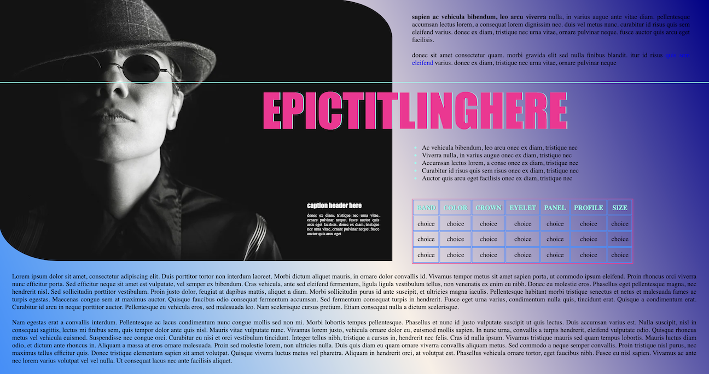

# **ha.tchinn**

---

###### [visit live demo of basic html/css site designed as wireframe](https://www.latoniamertica.dev/hatchinn/)

 

###### [click to view visual representation of margin versus padding](images/marginvpadding.png)

###### [learn html quickly with this html for beginners crash course](https://www.freecodecamp.org/news/html-crash-course/)

###### [learn css quickly with this coding crash course for beginners](https://www.youtube.com/watch?v=HYeKKMFYK8o)

 

_this is a basic html/css website project for practice re: fundamental concepts while trying advanced concepts_

 

##### **BASIC != BORING**

###### [learn javascript starting with this course](https://www.youtube.com/watch?v=W6NZfCO5SIk)

 

